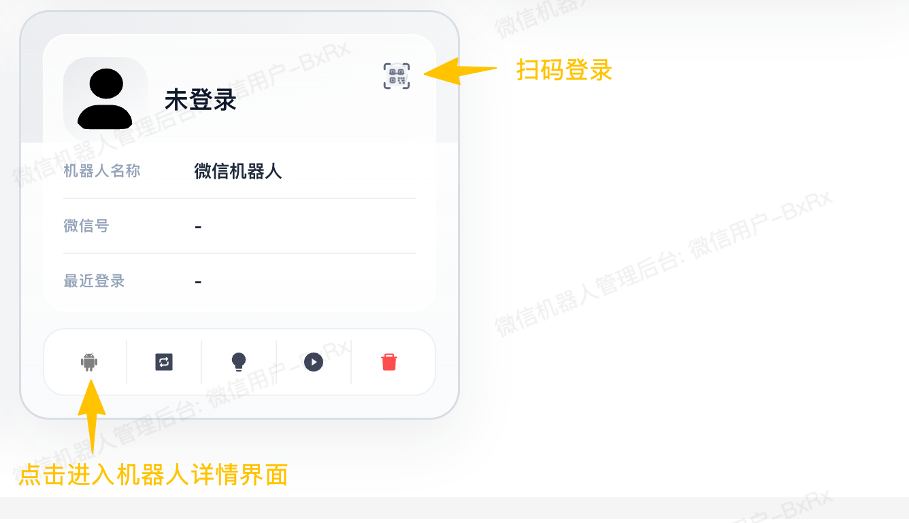
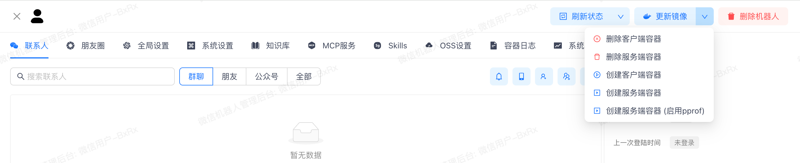
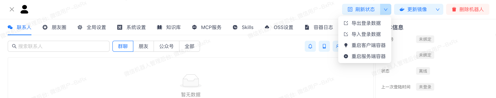
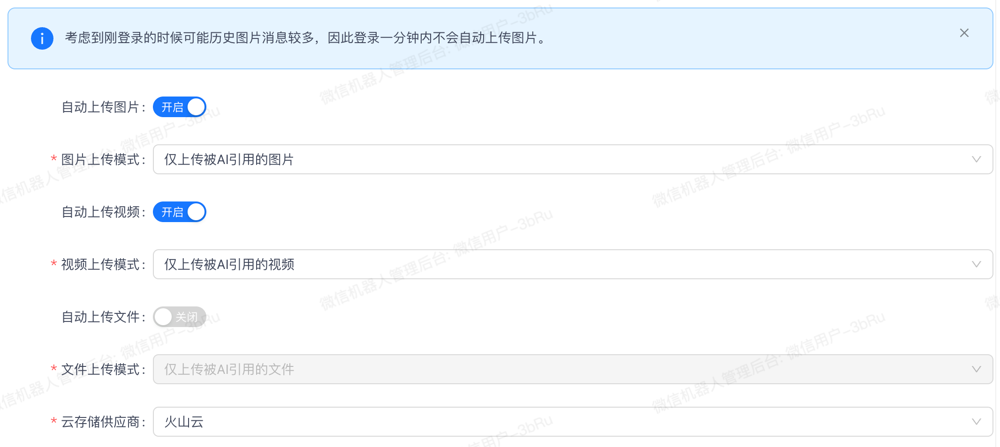
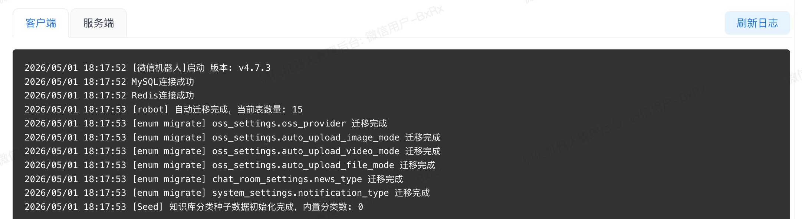
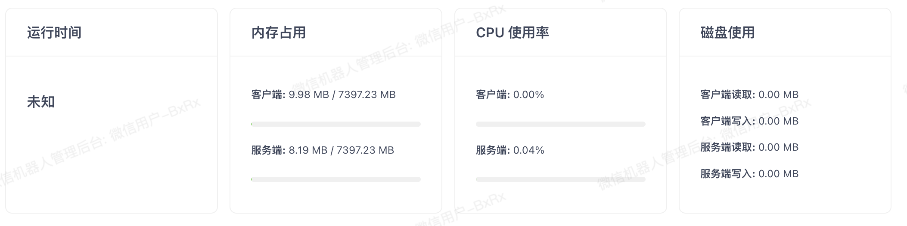

# 使用指南

## 创建机器人

- 点击右上角`创建机器人`按钮，快速创建一个机器人，机器人初始化需要一定的时间，请耐心等待

- 创建完成后，点击机器人卡片右上角的扫码按钮，扫码登录

- 如果登录卡在扫码界面不动了(扫码确认后，等待 10 秒左右是正常现象)，按照下面步骤排查下
  - 容器网络异常，尝试按照如下步骤操作，`删除客户端容器` -> `删除服务端容器` -> `创建服务端容器` -> `创建客户端容器`，然后重新扫码。
  - 开了科学上网工具，关了即可。

## 配置机器人

点击机器人卡片下边的机器人图标，进入机器人详情界面，如上图

- 删除机器人，会删除机器人数据库，销毁一切数据，请谨慎操作

- `更新镜像`用于升级机器人版本，更多查看[机器人升级指南](./upgrade.md)

- `删除客户端容器` 和 `删除服务端容器` 不会造成数据损失，也不会影响登录状态。重新创建客户端和服务端后无需重新登录。

- 启用 pprof 用于协议性能分析

- `导出登录数据` 用于将当前微信机器人的登录数据导出，可用于备份当前登录数据

- `导入登录数据` 将上面的导出数据导入到新机器人实例，使用场景：机器人部署设备迁移、升级机器人遇到问题，删除一切重来。目的都是提取设备 id，防止登录新设备登录不上。

### 联系人

敬请期待!

### 朋友圈

敬请期待!

### 全局设置

敬请期待!

### 系统设置

敬请期待!

### 知识库

#### 文本知识库

敬请期待!

#### 图片知识库

敬请期待!

### MCP 服务

敬请期待!

### Skills

敬请期待!

### OSS 设置

### 容器日志

- 客户端容器日志

- 服务端(协议)容器日志

### 系统概览

- 内存占用

- CPU 使用率

- 磁盘写入速率(不是磁盘占用)

