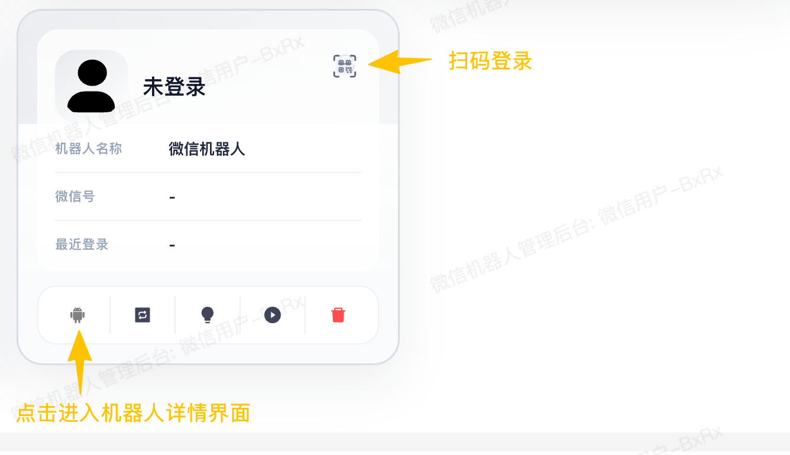
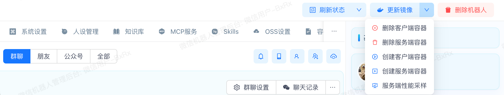
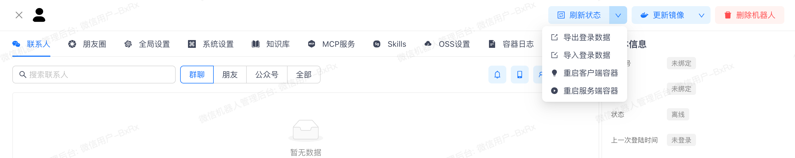
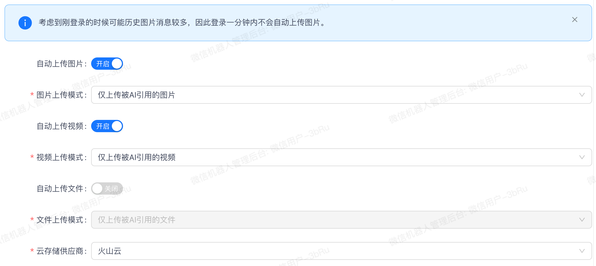
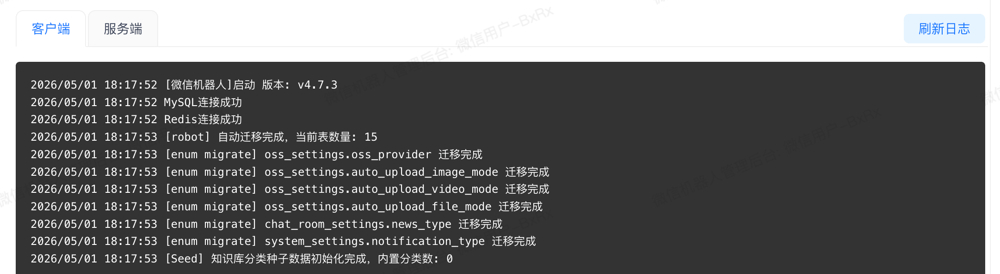
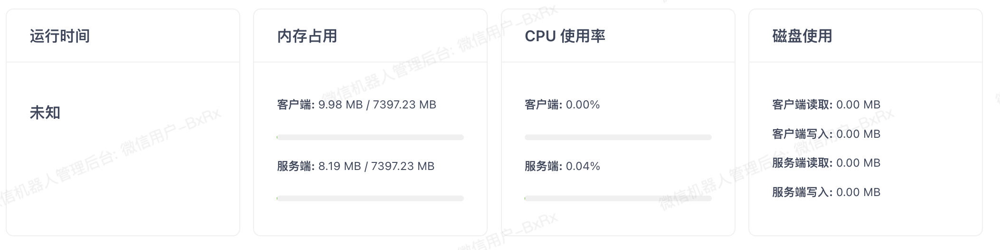

# 使用指南

## 创建机器人

- 点击右上角`创建机器人`按钮，快速创建一个机器人，机器人初始化需要一定的时间，请耐心等待

- 创建完成后，点击机器人卡片右上角的扫码按钮，扫码登录

- 如果登录卡在扫码界面不动了(扫码确认后，等待 10 秒左右是正常现象)，按照下面步骤排查下
  - 容器网络异常，尝试按照如下步骤操作，`删除客户端容器` -> `删除服务端容器` -> `创建服务端容器` -> `创建客户端容器`，然后重新扫码。
  - 开了科学上网工具，关了即可。



## 配置机器人

点击机器人卡片下边的机器人图标，进入机器人详情界面，如上图

- 删除机器人，会删除机器人数据库，销毁一切数据，请谨慎操作

- `更新镜像`用于升级机器人版本，更多查看[机器人升级指南](./upgrade.md)

- `删除客户端容器` 和 `删除服务端容器` 不会造成数据损失，也不会影响登录状态。重新创建客户端和服务端后无需重新登录。

- 启用 pprof 用于协议性能分析

- `导出登录数据` 用于将当前微信机器人的登录数据导出，可用于备份当前登录数据

- `导入登录数据` 将上面的导出数据导入到新机器人实例，使用场景：机器人部署设备迁移、升级机器人遇到问题，删除一切重来。目的都是提取设备 id，防止登录新设备登录不上。





### 联系人

联系人页面用于管理机器人当前微信号的好友、群聊、公众号，以及这些联系人对应的机器人能力。

进入机器人详情后点击`联系人`，建议先点击右上角的`同步联系人`按钮。同步完成后，可以通过搜索框按昵称、备注、微信号筛选联系人，也可以在`群聊`、`朋友`、`公众号`、`全部`之间切换列表。

常用操作如下：

- `发送消息`：主动给好友、群聊或公众号发送文本、图片、文件等消息。

- `聊天记录`：查看该联系人和机器人的历史聊天记录，排查 AI 回复、群聊总结、排行榜等功能是否正常触发。

- `好友设置`：给单个好友单独配置 AI 聊天、AI 绘图、文本转语音等能力。不填写具体模型或密钥时，默认使用全局设置。

- `群聊设置`：给单个群聊单独配置 AI 聊天、知识库、欢迎新成员、拍一拍、退群提醒、排行榜、群聊总结、每日早报、每日早安等能力。

- `添加好友`：搜索微信号并发送好友申请。

- `发起群聊`：选择好友创建新群聊。

- `查看群成员`：查看群成员列表，可用于群成员管理、设置记忆提取黑名单等场景。

- 群聊更多操作：邀请入群、修改群名称、修改群备注、修改群公告、退出群聊。

- 好友更多操作：查看指定好友朋友圈、修改好友备注、删除好友。

::: tip 使用建议
`全局设置`适合配置机器人默认行为；`好友设置`和`群聊设置`适合覆盖某个联系人或某个群的行为。群聊排行榜、群聊总结、每日早报、每日早安这类群运营功能，即使在全局设置里开启，也需要进入对应`群聊设置`里手动开启。
:::

::: warning 自动邀请入群
系统设置里的`自动邀请入群`会根据群昵称查找群聊，请确保联系人已经同步，并且群昵称不要重复。
:::

### 朋友圈

朋友圈页面用于查看、发布、点赞、评论朋友圈，也支持配置 AI 自动点赞和自动评论。

进入机器人详情后点击`朋友圈`，页面会自动加载朋友圈列表，向下滚动会继续加载更多内容。朋友圈里的图片、视频、点赞列表和评论列表都会在列表中展示。

常用操作如下：

- `发朋友圈`：发布朋友圈。可填写正文，选择图片或视频，设置提醒谁看、公开范围、指定可见好友、不给谁看。

- `评论`：对某条朋友圈发表评论。

- `点赞` / `取消点赞`：对朋友圈执行点赞操作。

- `删除`：删除机器人自己发布的朋友圈或机器人自己的评论。

- `朋友圈设置`：配置自动同步、自动点赞、自动评论和 AI 评论模型。

朋友圈设置里的关键项：

- `同步间隔`：机器人每隔多久同步一次朋友圈。修改后需要重启客户端容器才会生效。

- `自动点赞`：开启后，机器人会按设置自动判断并点赞朋友圈。

- `自动评论`：开启后，机器人会调用 AI 生成评论。同一个人每天只会自动评论一条朋友圈，点赞不受这个限制。

- `白名单`：只对选中的联系人自动点赞、评论。设置白名单后会忽略黑名单。

- `黑名单`：不对选中的联系人自动点赞、评论。

- `API地址`、`API密钥`：必须是兼容 OpenAI 的模型服务。示例: `https://new-api.houhoukang.com/`

- `工作流模型`：用于判断某条朋友圈是否适合点赞、评论，模型需要支持 JSON Schema，推荐使用响应快的小模型。工作流模型是用来在点赞、评论前用来判断朋友圈内容是否适合点赞、评论的，比如出现天灾人祸时就不适合点赞。工作流模型必须支持JSON Schema结构化输出，性能不用太好，追求速度快，推荐使用doubao-seed-2-0-lite-260215。

- `图片理解模型`: 用来理解朋友圈发的图片内容

- `视频理解模型`: 用来理解朋友圈发的视频内容，目前能理解视频的大模型只有`doubao-seed-2-0-pro-260215`

- `评论模型`和`评论提示词`：用于生成实际评论内容。

- `最大评论字数`: 最大评论字数是指AI生成的评论内容的最大字数限制，0表示不限制。

::: warning 朋友圈图片识别
评论朋友圈的时候只会识别前三张图片，同一个人，每天只会有一条朋友圈会被自动评论，点赞不受此限制。
:::

### 全局设置

::: warning 聊天设置
开启AI聊天设置会自动应用于每一个好友和群聊，也可以在好友设置和群聊设置里面单独定制化设置。
:::

**AI 聊天设置**

- `AI触发词`：唤醒AI的关键词，以关键词开头的消息会被AI处理，而不用手动@AI。留空时，群聊里通常需要手动 @ 机器人。

- `API地址`：比如，[https://new-api.houhoukang.com/](https://new-api.houhoukang.com/)，或者 [https://new-api.houhoukang.com/v1](https://new-api.houhoukang.com/v1) 或者 [https://new-api.houhoukang.com/v2](https://new-api.houhoukang.com/v2)，如果不是以版本号结尾，会自动补全一个/v1。必须是兼容 `OpenAI Chat API` 的接口地址，不支持 `Response API`。
  - 补充说明，为什么不支持 `doubao-seed` 系列的联网搜索、知识库等等插件，是因为这些插件只支持`Response API`。

- `API密钥`：模型服务密钥，比如可以在这里[https://new-api.houhoukang.com/keys](https://new-api.houhoukang.com/keys)获取一个 API 密钥，如果界面上没有，就手动创建一个。

- `聊天模型`：全局的聊天模型，如果好友设置/群聊设置里面没有设置聊天模型，那么就会使用全局的聊天模型。**特别注意**这里可以手动输入，如果列表里没有你想要的模型，可以在输入框手动输入模型。
  - **特别注意**提取记忆依赖全局聊天模型，这个模型必须支持`JSON Schema`，比如`doubao-seed` 系列的模型，pro 系列官方文档明确说明不支持 JSON Schema，`doubao-seed-2-0-lite-260428` 是支持的

- `会话持久记忆`：开启后，机器人会把对话中的长期信息提取到记忆里，后续聊天可按需召回。开启这个功能会显著增加词元(token)的消耗，会略微增加 AI 响应时间。

- `文本嵌入模型`和`文本嵌入维度`：用于文本知识库和长期记忆检索。[相关使用文档](https://help.aliyun.com/zh/model-studio/embedding?spm=a2c4g.11186623.help-menu-2400256.d_0_3_10_0.4c234c35xftnri)

- `图像识别模型`：用于识别聊天中的图片内容，让 AI 可以理解图片消息。

- `最大回复`：限制每次回复的最大词元数，填 `0` 表示不限制。

- `人设`：系统提示词，用于约束机器人的说话风格、身份和回答边界。
  - 人设管理编辑器右上角有个快速填充人设功能，需要在人设管理界面先创建好人设，然后在这里快速填充，一处定义，到处使用。

::: warning 修改嵌入模型
修改`文本嵌入模型`或`文本嵌入维度`后，需要到`文本知识库`点击`重建索引`，否则旧向量和新模型可能不兼容。
:::

**AI 绘图设置**

::: tip 绘图设置
想要使用 AI 绘图功能，需要在 Skills 管理界面安装`text-to-image`文生图技能或者`image-to-image`图生图技能。[官方 Skills 仓库](https://git.houhoukang.com/houhou/wechat-robot-skills)
:::

开启`绘图AI`后，好友和群聊可以使用绘图能力。绘图配置使用 JSON 编辑器维护，具体内容取决于你使用的绘图服务或 Skill。常见配置包括服务地址、密钥、默认模型、图片尺寸、生成数量等。

如果某个群或好友需要不同的绘图模型，可以在对应的`好友设置`或`群聊设置`中单独配置。

AI 绘图内置支持即梦、豆包、智谱、造相和 GPT，下面是绘图默认配置，可以通过 enabled 字段控制是否启用。

如果编辑器有红色警告，说明 JSON 语法错误，黄色警告，则说明配置错误。

```json
{
  "JiMeng": {
    "enabled": true,
    "base_url": "http://jimeng-api:9000",
    "model": "jimeng-4.1",
    "sessionid": ["xxxxxx"],
    "sample_strength": 0.5,
    "resolution": "2k",
    "ratio": "16:9",
    "response_format": "url"
  },
  "DouBao": {
    "enabled": true,
    "api_key": "xxxxxxx",
    "model": "doubao-seedream-4.0",
    "size": "2K",
    "response_format": "url",
    "watermark": false
  },
  "GLM": {
    "enabled": true
  },
  "Z-Image": {
    "enabled": true,
    "base_url": "https://api-inference.modelscope.cn/",
    "api_key": "xxxxxxx",
    "model": "Z-Image-Turbo"
  },
  "OpenAI": {
    "enabled": true,
    "base_url": "https://new-api.houhoukang.com",
    "api_key": "",
    "model": "gpt-image-2",
    "n": 1,
    "size": "auto",
    "quality": "auto",
    "background": "auto",
    "output_format": "png"
  }
}
```

**AI 文本转语音设置**

::: tip 文本转语音设置
想要使用 AI 文本转语音功能，需要在 Skills 管理界面安装`voice-message`文生转语音技能。[官方 Skills 仓库](https://git.houhoukang.com/houhou/wechat-robot-skills)
:::

开启AI文本转语音设置会自动应用于每一个好友和群聊，也可以在好友设置和群聊设置里面单独定制化设置。

开启`文本转语音`后，机器人可以把 AI 回复或指定文本转换成语音。

如果编辑器有红色警告，说明 JSON 语法错误，黄色警告，则说明配置错误。

- `语音模型`：当前支持`豆包`和`小米`。

- `语音设置`：使用 JSON 编辑器维护，例如音色、语速、音量、服务参数等。

默认语音配置如下:

```json
{
  "doubao": {
    "request_body": {
      "namespace": "",
      "req_params": {
        "audio_params": {
          "format": "mp3",
          "sample_rate": 24000
        },
        "model": "",
        "speaker": "zh_female_vv_uranus_bigtts",
        "text": ""
      },
      "user": {
        "uid": ""
      }
    },
    "request_header": {
      "X-Api-Access-Key": "",
      "X-Api-App-Id": "",
      "X-Api-Request-Id": "",
      "X-Api-Resource-Id": "seed-tts-2.0",
      "X-Control-Require-Usage-Tokens-Return": ""
    },
    "url": "https://openspeech.bytedance.com/api/v3/tts/unidirectional"
  },
  "mimo": {
    "model": "mimo-v2.5-tts"
  }
}
```

**群聊欢迎新成员设置**

开启欢迎新成员会自动应用于每一个群聊，也可以在群聊设置里面单独定制化设置。

开启`欢迎新成员`后，新成员进群时机器人会自动发送欢迎内容。欢迎形式支持：

- `纯文字`：发送欢迎语。

- `表情包`：填写表情包 MD5 和长度。可以在聊天记录界面，按下 F12 打开浏览器控制台，切换到`网络`面板，查看接口返回数据找到这两个参数，也可以去机器人 mysql 数据库查找这两个参数。

- `图片`：填写图片地址。

- `卡片`：填写欢迎语和链接地址。

**群聊拍一拍设置**

开启拍一拍交互会自动应用于每一个群聊，也可以在群聊设置里面单独定制化设置。

开启`拍一拍`后，群成员拍机器人时会自动回复。交互类型支持：

- `文字`：直接发送配置的文字。

- `语音`：把配置的文字转换成语音发送，需要填写语音音色。需要先设置好 `AI 文本转语音设置`

**群聊退群提醒设置**

开启群聊退群提醒设置会自动应用于每一个好友和群聊，也可以在好友设置和群聊设置里面单独定制化设置。

开启`退群提醒`后，有成员退出群聊时机器人会在群内发送提醒。提醒文本可使用 `{placeholder}` 表示退出群聊的成员名称。

**群聊排行榜设置**

开启后可配置每日、每周、每月发榜时间。排行榜发布的是前一天、上一周、上个月的数据。

::: warning 生效范围
排行榜不会自动应用到所有群聊。全局设置只是提供默认参数，仍需要进入具体`群聊设置`手动开启排行榜。
:::

**群聊总结设置**

开启后可配置总结模型、显示模式和每天总结时间。显示模式支持`文本`和`图片`，总结内容来自前一天的聊天记录。

::: warning 生效范围
群聊总结不会自动应用到所有群聊。需要进入具体`群聊设置`手动开启。
:::

**每日早报和每日早安**

- `每日早报`：可选择文字或图片形式，按每天设定时间发送前一天新闻。

- `每日早安`：按每天设定时间发送前一天群聊总结式问候。

这两个功能也需要在具体`群聊设置`中手动开启。

### 系统设置

系统设置用于配置机器人和外部系统交互、通知、安全调用以及自动处理策略。

- `Webhook 地址`：配置后，机器人会以 `POST` 方式把微信的消息转发到该地址，同时 query 参数会携带 robot_id robot_code robot_wxid。

- `Webhook 请求头`：JSON 格式，可填写 `Authorization`、`X-API-Key`、`Content-Type` 等自定义请求头，主要还是处理权限认证问题，没有权限认证方面的诉求可以不填请求头。

- `Api密钥调用接口`：开启后可以使用 Api 密钥调用管理后台接口。Api 密钥支持三种传递方式：`Authorization` Header、`X-API-Token` Header、`api_token` Query 参数，`开启然后点击保存，即可看到 API 密钥`。

- `API 密钥`: Api密钥用于调用接口，刷新后以前的Api密钥将失效，支持Authorization Header、X-API-Token Header、api_token Query参数三种方式调用接口 (界面上所有需要登录态的接口均可使用Api密钥调用)

- `刷新 Api 密钥`：刷新后旧密钥立即失效。

- `离线通知`：机器人离线时发送通知。当前可选择`推送加`或`企业微信`。

- `推送加`：填写推送加地址(https://www.pushplus.plus/send)和用户 token(https://www.pushplus.plus/uc.html页面的用户token)。

- `企业微信`：填写企业 ID、AgentId、Secret，可选代理地址和推送用户 ID；推送用户 ID 不填默认 `ALL`，多个用户 ID 用 `|` 分隔。

- `自动通过好友`：开启后自动通过好友申请，可设置延迟秒数，降低风控风险。

- `自动邀请入群`：开启后，发送申请进群 xxx群 (申请进群后面必须带空格，xxx群为群昵称) 自动加入群聊，根据群昵称查找群聊，请确认联系人已经同步且群昵称没有重复。

::: danger 高危操作
`自动通过好友`可能触发微信风控，请谨慎开启。系统在多个好友申请同时到来时，每通过一个申请会额外休眠 10 秒。
:::

### 知识库

知识库用于给 AI 提供可检索资料。创建知识库后，在`群聊设置`里把知识库绑定到群聊，AI 回复时会按需检索相关内容并引用，从而提升专业性和一致性。

知识库依赖向量数据库 Qdrant。快速开始的 compose 文件已经包含 `wechat-admin-qdrant`，如果你自定义部署，请确认 Qdrant 服务和 `QDRANT_*` 环境变量配置正确。

#### 文本知识库

文本知识库适合录入 FAQ、产品说明、群规、教程、业务资料等文本内容。

使用流程：

1. 点击`新建知识库`，填写`知识库编码`、`知识库名称`和`描述`。

2. 打开某个知识库的文档管理，点击`新建文档`。

3. 填写`文档标题`和`文档内容`。文档内容使用 Markdown 编辑器。

4. 保存后系统会生成向量索引，文档列表会显示分块数量、向量 ID、创建时间和更新时间。

5. 进入需要使用资料的`群聊设置`，在`绑定知识库`里选择这个知识库。

文档分块规则：文档片段之间使用两个或以上空行分片；如果单个片段超过 1000 个字符，系统会强制分片。

也可以在群聊中通过指令录入知识库：先引用一条符合下面格式的消息，再发送`#录入知识库 知识库名称`。

```text
知识文档名称
--#--
知识文档内容
```

该指令仅群管理员可用，知识库名称可以填写知识库名称或知识库编码。

常用操作：

- `编辑`：修改知识库名称、描述或文档内容。

- `删除`：删除知识库或文档。系统内置知识库不能删除。

- `启用` / `禁用`：控制单篇文档是否参与检索。

- `重建索引`：删除原有索引并重新创建，适合修改嵌入模型、批量更新文档、检索结果异常后使用。

::: warning 重建索引
重建索引任务通常需要几分钟。点击后请关注客户端容器日志，等待任务完成后再测试 AI 检索效果。
:::

#### 图片知识库

图片知识库用于保存图片及其描述，并支持以文搜图、以图搜图等图片向量检索能力。后台接口已经支持图片文档的新增、删除、列表、检索和重建图片索引。

当前管理后台页面可以创建、编辑、删除图片知识库分类，并可以通过`重建索引`统一重建向量索引。图片条目的可视化管理界面仍在完善中，如果需要使用图片知识库，请优先通过 Skills、MCP 服务或接口接入图片写入流程。

图片文档需要包含：

- `标题`：图片资料名称。

- `描述`：用于帮助模型理解图片内容。

- `图片地址`：可被客户端访问的图片 URL。

- `分类`：图片知识库编码。

::: tip 使用建议
图片知识库适合表情包、素材库、商品图、案例图等场景。图片地址建议使用稳定可访问的 OSS 地址，避免临时链接失效导致重建索引失败。
:::

### MCP 服务

MCP 服务用于给机器人扩展工具能力。添加 MCP 后，AI 可以在对话中调用外部工具，例如查询数据、执行工作流、访问第三方服务等。

进入`MCP 服务`页面，点击`添加 MCP 服务`，填写基础信息：

- `名称`：服务显示名称。

- `描述`：告诉 AI 这个服务能做什么。

- `优先级`：数字越大优先级越高。

- `标签`：用于标记服务能力。

- `类型`：支持`命令行模式（标准输入输出）`和`流模式`。

命令行模式适合在客户端容器内启动本地 MCP：

- `命令`：要执行的命令。

- `运行目录`：可选，命令执行目录。

- `命令行参数`：逐项填写参数。

- `环境变量`：JSON 格式，用于注入密钥、开关、服务地址等。

流模式适合连接远程 MCP 服务：

- `服务地址`：MCP 服务 URL。

- `认证方式`：支持无认证、Bearer Token、Basic、API Key。

- `请求头`：JSON 格式的额外请求头。

- `跳过TLS证书验证`：自签名证书或内网测试时可开启，公网环境不建议开启。

- `连接超时时间`、`读取超时时间`、`写入超时时间`、`最大重试次数`、`重试间隔`：用于控制网络稳定性。

列表中的状态说明：

- `在线`：服务已启用且没有最后错误。

- `官方`：系统内置 MCP 服务，通常不允许编辑。

::: warning 功能迁移
文生图、图生图、生成视频、文本转语音等能力已经从内置 MCP 服务中移除，请优先使用 Skills 扩展。
:::

### Skills

Skills 是机器人内置的技能扩展系统，适合安装点歌、视频解析、绘图、外部 API 调用、自动化工作流等能力。

进入`Skills`页面后，如果列表为空，可以前往 [Skills 技能市场](https://git.houhoukang.com/houhou/wechat-robot-skills) 查找可用技能。

安装方式：

- `从 Git 仓库安装`：点击`安装技能`，填写技能安装地址，例如 `https://git.houhoukang.com/houhou/wechat-robot-skills/src/branch/main/skills/kfc`，安装成功后按提示重启客户端。

- `从本地安装`：在 `docker-compose.yml` 同级目录下找到 `wechat-robot/{机器人编码}/data/skills`，创建一个符合 Skills 命名规范的英文目录，把技能代码放进去，重启客户端后会自动发现。

技能列表常用操作：

- `启用` / `禁用`：控制技能是否参与运行。

- `环境变量`：给技能注入私密信息，例如第三方 API 密钥、账号配置、服务地址。环境变量使用 JSON 格式保存。

- `更新技能`：从安装源更新技能代码。更新后通常需要重启客户端才能生效。

- `卸载`：删除技能。只有禁用状态的技能可以卸载。

::: tip 重启客户端
安装、更新、本地新增技能后，建议立即重启客户端容器。管理后台会在安装和更新成功后弹出是否立即重启的确认框。
:::

### OSS 设置



### 容器日志

- 客户端容器日志

- 服务端(协议)容器日志



### 系统概览

- 内存占用

- CPU 使用率

- 磁盘写入速率(不是磁盘占用)


