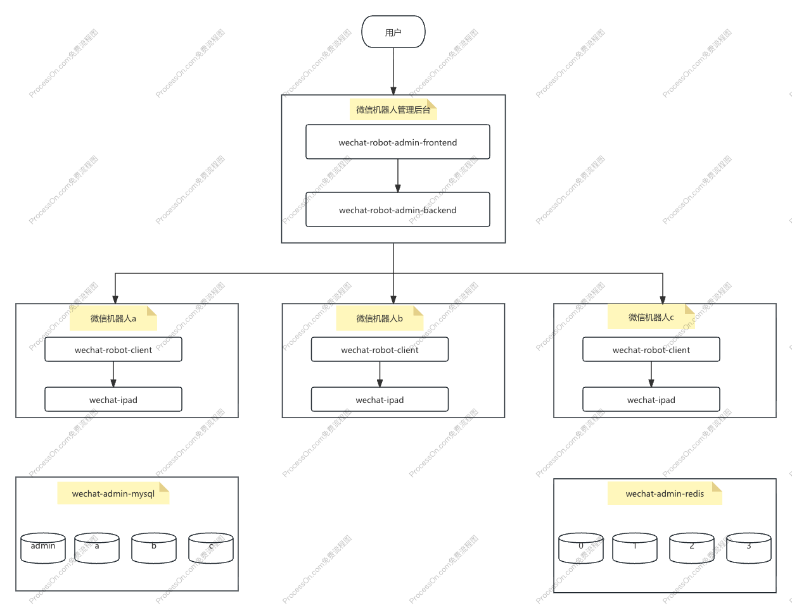

# 项目架构

## 架构概览

### 六个必须容器

- wechat-admin-redis `redis 数据库`

- wechat-admin-mysql `mysql 数据库`

- wechat-robot-admin-frontend `管理后台前端服务`

- wechat-robot-admin-backend `管理后台后端服务`

- client_xxx `由后端服务动态创建的机器人客户端服务`

- server_xxx `由后端服务动态创建的机器人 iPad 服务`

### 反向代理容器

- wechat-nginx `非必须，可以在宿主机部署 nginx 解决`

### 其他非必须容器

- wechat-robot-mcp-server `官方内置 MCP 服务，不部署无法使用一些列内部工具`

- netease-cloud-music `网易云点歌服务，不部署的话，无法使用点歌功能`

- xiaohongshu-mcp `小红书 MCP 服务，不部署无法使用小红书 MCP 工具`

- jimeng-api `即梦逆向 API，不部署无法使用即梦绘图`

- word-cloud-server `根据文字生成词云，不部署群聊总结的时候无法生成词云`

- wechat-uuid `生成过 Mac 滑块的 uuid`

- wechat-slider `过 Mac 滑块服务，需要配合 wechat-uuid 生成 uuid`

- wechat-server `如果需要通过微信公众号登录的话，需要部署这个服务，提供微信权限认证`

- wechat-admin-qdrant `向量数据库，查询知识库、长期记忆需要用到`

## 项目架构图

